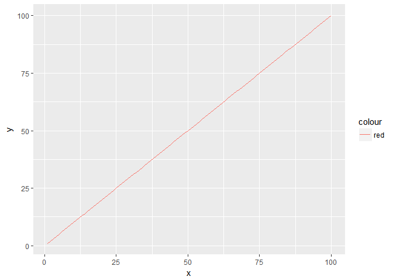

# Ocean pH
K. Dorheim  
`r format(Sys.Date(), "%B %d, %Y")`  

# House Keeping Notes
****

# Methodology 
****

None of the variables in question have depth information. 

#### L1
1. CDO - Concatenate cmip netcdfs and convert to absolute time 
2. CDO - Get the field weighted mean via cdo 
3. R - Remove model with unrealistic or missing pH/CO3 observations 
4. R - Concatenate the all of the csv files created on pic into a single RData object

<br>


```
## Warning: package 'dplyr' was built under R version 3.4.1
```

<!-- -->


The End
